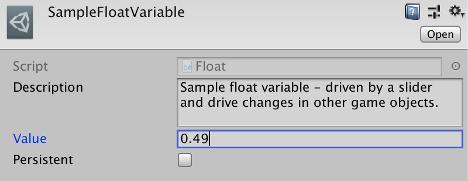
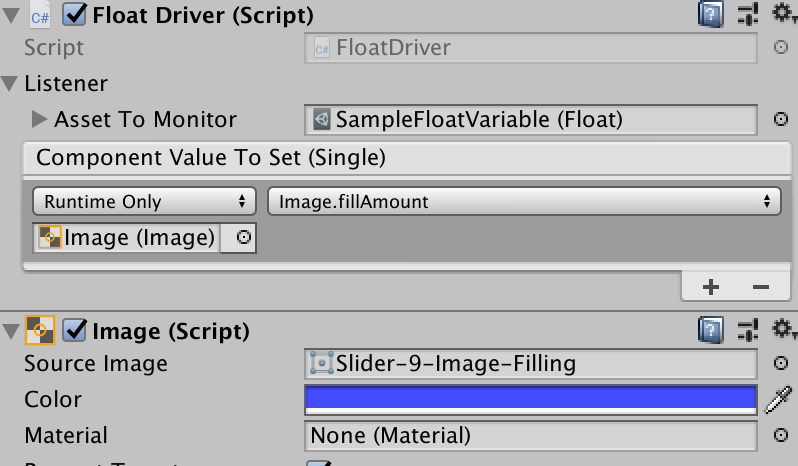
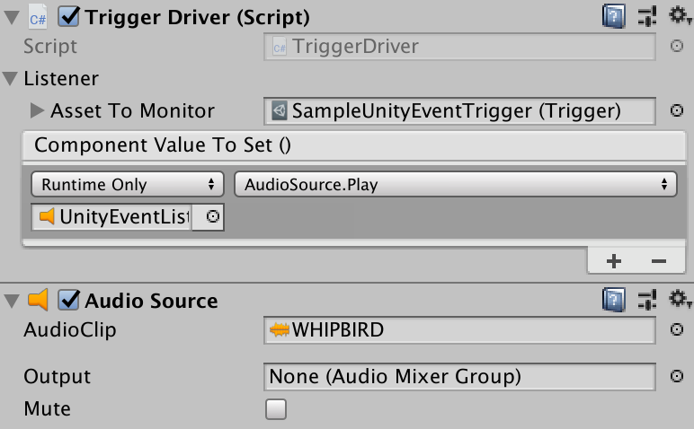
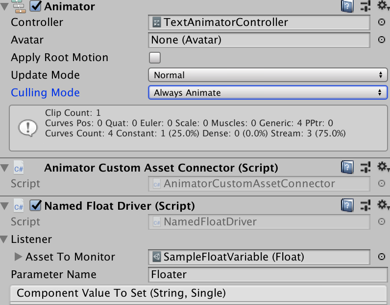
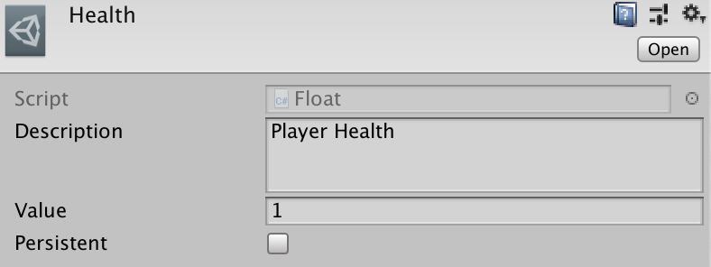
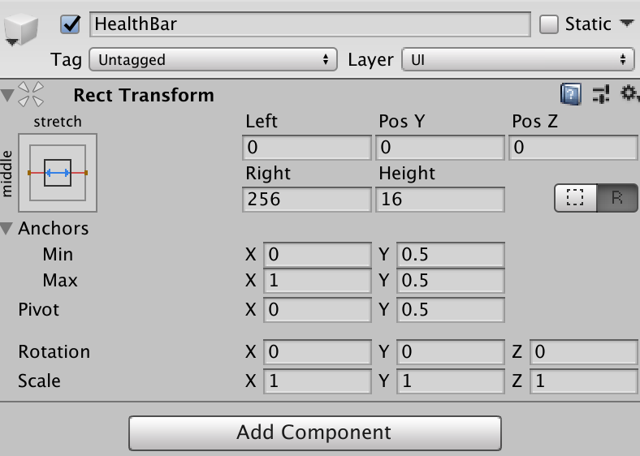
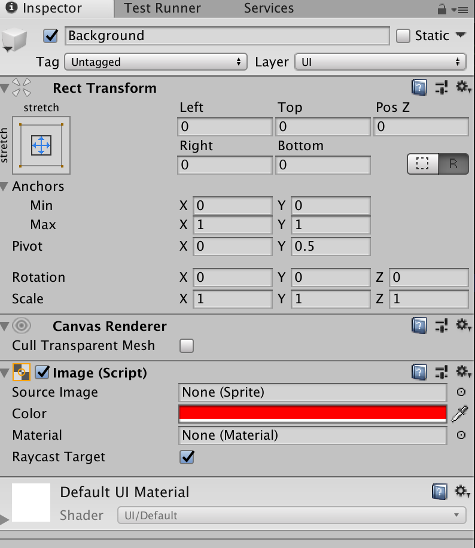

# [Custom Assets](http://www.askowl.net/unity-customassets)

## Executive Summary
Custom assets are project resources that contain data and code wrapped in a Unity ScriptableObject. Also, they provide emitters to signal change and persistence between sessions.

I have chosen to use this executive summary to provide examples on how you can use custom assets.

### Decoupling Components
After you create a custom asset in the project, any reference in components is to the same object. Our example is the ubiquitous player health - a value between zero and one that needs to be accessed by components to:
* display a health bar on the screen
* show health percentages on a status page
* trigger death animation on reaching zero
* be reduced by damage (hit, poison, fall)
* be increased by time, potions, medkits.
* be reviewed by other actions (such as no jumping on low health)
In this example a CustomAsset.Float project resource does the job while markedly reducing the amount of code and support compared to a singleton.

See how easy it is to create [here](#health-bar) and in (this)[https://www.youtube.com/watch?v=] in xx minutes. Use the same techniques for stamina, mana, progress and the many other measures used in games. Then branch out to more uses.

* Table of Contents
{:toc}

> Read the code in the Examples Folder and run the Example scene

## Introduction
Unity provides a base class called [ScriptableObject](https://docs.unity3d.com/ScriptReference/ScriptableObject.html). Derive from it to create objects or assets that don't need to be attached to game objects.

In short, a `ScriptableObject` is a class that contains serialisable data and functionality. Each instance of a class that derives from `ScriptableObject` has representation on disk as an asset. Each asset is a source for data and actions not coupled to a scene. The decoupling makes for functionality that is easy to test. It also provides modules to be shared across and between projects.

Custom assets are Unity scriptable objects on steroids. They provide the glue that allows you to piece together a better game.  

1. Better than singletons
  1. Share information across scenes, game objects and components; and
  2. Seed it as a resource in the project; and
  3. Have it made read-only, read/write and even persistent; and
  4. Drive components directly without additional code; and
  5. Add a description to each custom asset to clarify usage; and
  5. Attach to existing components to provide dynamic action without code
        1. Start and stop animations with a trigger, boolean, integer or float custom asset; or
            2. Control canvas groups, image fill or text field content with float and string custom assets
2. Packaged with many useful standard custom assets
  1. ***Boolean*** - where components can react to a change of state
  2. ***Integer*** - that can be changed by code or visual slider
  3. ***Float*** - components can react and/or display results on value change
  4. ***String*** - for display or detailed action control
  5. ***StringSet*** - provides a more powerful and flexible alternative to enums
  6. ***Trigger*** - an emitter where components can attach as needed without additional code
  7. ***Polling*** - to provide custom asset triggers for external data changes
  8. ***IoT*** - Triggers for hardware
        1. Compass
            2. Gps
                3. Gyroscope
                    4. WebCam
  9. ***AudioClips*** - allowing random selection from a set of audio clips with variations in volume, pitch and distance to provide a better audio experience for your players
  10. ***Quotes*** - Load and retrieve text from within the component or other text resource files either randomly or in sequence. Good for quotes, jokes, game hints or news feeds.
3. Create your custom assets with any serialisable data and optional supporting scripts
4. Every custom asset has a dictionary of members to save more than one copy of data - accessed by name.

### Custom Assets - the new Singleton
Static variables are not evil, just inflexible. Singleton MonoBehaviour instances are not corrupt either. However, both encourage tight coupling between interested parties.

So now for a bit of mild blasphemy. Assets created from scriptable objects, and hence custom assets are Unity supported *singletons*. Create `[SerializeField]` fields and drag an asset of the correct type onto them in the editor. All reference to the same in-memory instance.

Using custom assets over traditional singletons provide some benefits:

* Code is less coupled - or is that more decoupled?
* Custom assets can be tested in isolation.
* Alternative custom assets can be injected into objects that are expecting them. An inventory may depend on location or whether the player is in training mode.
* It is less error prone to pass custom assets between scenes and projects.
* Functionality can be more generalised for direct reuse from within the editor without writing as much scaffolding code. A `Float` custom asset, for example, can have components that hook into display objects. Sliders and scroll-bars can also update it without additional code by adding it to the *On Value Changed* field.
* A custom asset as a singleton to hold game data has one massive failing. There is one copy only. If you want to store player health for an unknown number of players, how do we save it? For this, custom assets have the concept of members. Each named entry holds a reference to the custom asset storage that can be accessed by member name.

### Custom Assets as Game Managers
Managers are a favourite Unity pattern. As well as a system-wide master manager, many games have them for player, enemies, sound and more. They have some standard features:

* They are accessed by a static `Instance` variable.
* They are a MonoBehaviour that sets `Instance` in `Awake()`.
* They call `DontDestroyOnLoad(gameObject)` if they are to be common across scenes.
* There is often one manager to rule them all.

It is not uncommon to see code like:

```c#
health = GameManager.Instance.PlayerManager.MaxHealth;
```

Try testing that component in isolation.

By contrast, a custom asset approach would be more like:

```c#
[SerializeField] PlayerManager;
...
health = PlayerManager.MaxHealth;
```

To work with this version create a test scene and put in an individual PlayerManager custom asset. It might have different data, or it might include mock methods.

### Custom Assets as Configuration
The most common use for scriptable objects is to ignore the scriptable part and use them as configuration containers. A Custom Asset is a file within the project. This file contains a reference to the script and serialised copies of all the data as added in the Unity editor.

You can safeguard the serialisable data by making it a private `[SerializeField]` and using accessors to allow reading. Alternatively, you can use them as seed data and change them during program execution.

```c#
class MyData : CustomAsset {
[SerializeField] private int maxHealth;
[SerializeField] private float timeOfDay;

// maxHealth cannot be changed outside this class
public int MaxHealth { get { return maxHealth; } };
// timeOfDay can be updated
public float TimeOfDay { get { return timeOfDay; } set { timeOfDay = value; } };
```
Later I will introduce better and more granular ways to handle data.

### Read-only Custom Assets
The custom asset inspector allows a designer to mark the asset read-only For serialisable classes as values, protection of internal data is still code bases. Make the fields private and serialisable so that the editor can change them. Then use accessors without `set` to only allow for reading. If you can't trust the code accessing data in a complex object graph, either clone the custom asset or lock down access at all levels.

```c#
var clone = Object.Instantiate(myCustomAsset).Value;
```

Cloning is much more expensive at runtime than baking in protection during the compile phase.

### Custom Assets and Persistence
Custom Assets adds optional persistence to scriptable objects. Persistent assets must be read/write and have the `persistent` field set in the Unity Editor.

Each persistent object is serialised to JSON and written as a `PlayerPref` entity. For this reason, the total storage is about one megabyte. For more massive storage needs, use a database.

The key is made up of the name of the asset and the class name, making it unique to the application.

Set persistence from the Unity inspector or code.

```c#
myAsset.Persistence = true;
```

## Accessing Custom Assets

A custom asset is like any other Unity asset. Create a field for it in a MonoBehaviour or other CustomAsset class and drop in the reference.

```c#
public sealed class CustomAssetsExample: MonoBehaviour {
  [SerializeField] private Float             maxFloat;
  [SerializeField] private Float             currentFloat;
  // ...
}
```


Custom assets aid decoupling. Many components can operate without directly knowing each other.

Access custom asset values by either casting or using the `Value` getter. ToString() will aways call ToString() on the Value field.
```c#
Debug.LogFormat("{0} == {1}",maxFloat.Value, ((float) maxFloat);
Debug.LogFormat("{0} == {1}",maxFloat.Value.ToString(), maxFloat.ToString());
```

### Instance
There is a second way. As long as a custom asset is referenced as above at least once, it is available with code access elsewhere.

```c#
Float lifetime = Float.Instance("Lifetime");
UniqueAsset = UniqueAsset.Instance(); // "UniqueAsset" name optional
```

The static Instance method is also useful for in-memory custom "assets". The first call creates a copy while other calls retrieve a reference. You can even keep the value between invocations of the game by setting persistence.

```c#
lifetime.Persistence = true;
```

## Creating Custom Assets
Custom Assets are ScriptableObjects serialised and written to disk as an asset in the project.

```YAML
%YAML 1.1
%TAG !u! tag:unity3d.com,2011:
--- !u!114 &11400000
MonoBehaviour:
  m_ObjectHideFlags: 32
  m_PrefabParentObject: {fileID: 0}
  m_PrefabInternal: {fileID: 0}
  m_GameObject: {fileID: 0}
  m_Enabled: 1
  m_EditorHideFlags: 0
  m_Script: {fileID: 11500000, guid: 22f206729bb7e417e9b12649707e941e, type: 3}
  m_Name: SampleFloatVariable
  m_EditorClassIdentifier: 
  Description: 
  value: 0
  readWrite: 1
  persistent: 0
```
Each custom asset type has an entry on the ***Create / CustomAssets / asset name***. Use it, select the resulting file and fill in the fields. If you want to load it from disk using `Resources.Load(pathFromResources)` you will need to place it in a ***Resources*** folder.

### OfType&lt;T>
`CustomAsset.OfType<T>` is the base type for all custom assets except `Trigger`. Functionality includes being able to register events on change, persistence and some read-only protection.
```c#
[CreateAssetMenu(menuName = "Examples/LargerAssetSample")]
public class LargerAssetSample : CustomAsset.OfType<LargerAssetContents> { }

[Serializable]
  public class LargerAssetContents {
    public int    Order;
    public float  Limit;
    public string Name;
  }
```

All CustomAsset instances have a description field. Since you can use generic assets, it is useful to give others comments on what specific assets represent.

### Primitive Custom Assets
```c#
  [SerializeField] private Float             currentFloat;
  [SerializeField] private Integer           integer;
  [SerializeField] private String            str;
  [SerializeField] private Boolean           boolean;
```
Each if these custom assets can be in a project with or without supporting code. It is possible, for example, to have a `Float` value set in the ***On Value Changed*** field of a Slider or Scrollbar, then displayed using a driver like `CustomAsset.FloatDriver` to set the fill amount on a health bar Image component.

### Trigger
A trigger is unusual in that it does not have any data apart from CustomAsset requirements. Triggers do not have persistence, so a subclass containing data cannot be saved.

### Members
A custom asset with any content data also can store and retrieve separate copies by name. For persistent custom assets, the member names and values saved to storage along with the main value.

```c#
[SerializeField] CustomAsset.Integer myInt;
// ...
myInt.Value = 22;
myInt["One"] = 1;
myInt["Two"] = 2;

string[] names = myInt.MemberNames;
Assert.AreEqual(names.Length, 2);

Assert.AreEqual(myInt["One"], 1);
Assert.AreEqual(myInt.ToStringForMember("One"), "1");
Assert.True(myInt.Contains("One"));

myInt.Remove("One");
Assert.False(myInt.Contains("One"));

Assert.True(myInt.Contains("Two"));
myInt.Clear();
Assert.False(myInt.Contains("Two"));
```
`ToStringForMember` requires special mention as it can be use in Inspector event receivers to set values directly.

### Custom Asset Sets
`Set`, like `OfType` is a generic class. To instantiate it requires the type of set entries.

```c#
[CreateAssetMenu(menuName = "Examples/SetPicker", fileName = "SetPickerSample")]
public sealed class SetPickerSample : Set<AudioClip> {
  public void Play() { AudioSource.PlayClipAtPoint(clip: Pick(), position: Vector3.zero); }
}
```
This example can be used to play one of a selection of sounds. This is a great way to make a game sound less tedious.

#### Pick()
All classes inheriting from `Set` have a `Pick()` method with two controlling field entries:
* ***cycle***: True to return entries sequentially, false to get a random selection.
* ***exhaustiveBelow***: If the number of entries in the set is below this value, then while `Pick()` returns a random entry, no entry is retrieved twice before all the others have had a turn. From a list of three, nothing appears random.

These options are available in the editor when you create a custom asset from a `Set`.

#### Add(entry)
While in most cases the `Set` will be filled by the Unity Editor to save as an Asset, there are occasions where adding additional elements will be needed.
#### Remove(entry)
On occasions, a `Set` entry will expire, and it will be necessary to remove them.
#### Contains(entry)
See if a `Set` contains a specific entry.
#### Count
Retrieve the number of entries in a set.
#### ForEach
Call an action for every entry in a set. If the action returns false, all is complete.
```c#
mySet.ForEach((s) => {return s!="Exit";});
```
#### StringSet
Strings as a set have many usages. `Quotes` is an implementation of `StringSet`.

### AudioClips
Playing one from a selection of audio clips have been a well-used proof of concept for `ScriptableObject`. Because custom assets, sets and some other toys from this package make the implementation even simpler, I am displaying the source here.

```c#
  [CreateAssetMenu(menuName = "Custom Assets/Sound Clips", fileName = "Clips")]
  public sealed class AudioClips : Set<AudioClip> {
    [SerializeField, Header("Audio")]     private Range volume   = new Range(1, 1);
    [SerializeField, RangeBounds(0, 2)]   private Range pitch    = new Range(1, 2);
    [SerializeField, RangeBounds(0, 999)] private Range distance = new Range(1, 999);

    public void Play(AudioSource source) {
      source.clip        = Pick();
      source.pitch       = pitch.Pick();
      source.volume      = volume.Pick();
      source.minDistance = distance.Min;
      source.maxDistance = distance.Max;
      source.Play();
    }
  }
```
`Range` class and `RangeBound` attribute are available in the custom assets package. `AudioClips` will work without them, but sliders are easier to use.

The actor, `Play`, requires an `AudioSource`. An audio source must be attached to the game object that is to make a sound so that it comes from the correct source. It cannot be part of a custom asset which is not a component.

Fortunately, the Unity framework has a solution to that problem. It is called `UnityEvent`.

```c#
  [SerializeField] private AudioClips audioClips;
  [SerializeField] private UnityEvent audioClipsEvent;
```
will display in the inspector as follows.


The reference to `AudioClips` is optional. It is only there so that we can change the fields in the editor without going to the asset.

If you are calling `Play` from code, then you can supply an `AudioSource` or a game object that has an audio source component.

```c#
  [SerializeField] private AudioClips audioClips;
  void Play() { audioClips.Play(gameObject); }
  void Play1() { audioClips.Play(GetComponent<AudioSource>(); }
```

Using `AudioClips` wherever you have sound effects makes your game sound a lot more lively. You could also consider making similar assets for visual effects or animations.

## Editing Custom Assets
Serialised fields can be edited in the Unity Inspector just as you would a MonoBehaviour attached to a game object. Unlike a scriptable object, custom assets unload when play mode completes. In this way, they behave more like MonoBehaviours. There is a reason for this madness. In the Unity editor, scriptable objects remain loaded and only reload if the backing code or asset changes on disk. If we don't reset on leaving play mode, changed data from one run lives to the next.

## Custom Assets as Resources
If you can accept the tighter coupling, you can load custom assets my name. It is an alternative to dropping them into referring fields in the Unity inspector. The custom asset must reside in a directory under a ***Resources*** path - anywhere in the project.

```c#
// expects /anywhere-in-assets/Resources/Audio/cow-sounds.asset
var moos = Resources.Load<AudioClips>("Audio/cow-sounds");
```

## Custom Assets as Event Sources
The first significant departure from ScriptableObject that CustomAsset provides is the ability to act as an event source.

Primitive custom assets (trigger, boolean, integer, float and string) are extremely easy to use. Drag a reference using the Unity editor into any MonoBehaviour or CustomEvent that needs to access or update them.

Drivers and Connectors (described below) also need a reference. They register for changing events. The event fires when and only when the custom asset changes.

## Using Custom Assets
Life begins now. Without writing any code, you can use the prepackaged custom assets and listeners to connect components without them knowing about each other.

Don't believe me? Create a game object inside a canvas and add a slider component.

***Step 1***: Create a Float custom asset from the Unity editor main or context menu.


***Step 2***: Select the custom asset and add any initial data.



***Step 3***: Create a new GameObject in the Unity Hierarchy window. Make sure it is inside a Canvas GameObject.


***Step 4***: Go to the inspector for the game object *Slider* and add a slider component.


***Step 5***: Add an *On Value Change* field and drag the Float custom asset into the associated field. Use the function drop-down to select ***Float: Value***.


***Step 6***: Lock the inspector on the Float custom asset and run the scene. Drag the slider and watch the value change in the inspector.


For extra points, we can create a codeless health display bar.

***Step 7***: Create a UI Button GameObject in a Canvas and change the image type to *Filled*. Note that moving the *Fill Amount* slider causes the button to change background proportionately.


***Step 8***: Press the *Add Component* Button then search for and add the *FloatDriver* component. Set the custom asset to the one created above and the component value setter to *Image.FillAmount*.


***Step 9***: Run the application and move the slider created above. The button fills and empties accordingly.


For components, like Animator, with named values Used *NamedFloatDriver* and it's siblings.

### Referencing CustomAsset Contents
Anywhere you want direct access to a custom asset, create a reference in your MonoBehaviour, CustomAsset or ScriptableObject and assign it in the inspector.

``` c#
class MyHealthComponent : MonoBehaviour {
  [SerializedField] CustomAsset.Float health;

  private void OnEnable() => health.Value = 1.0F;
}
```

You can also use the custom access emitter directly to react to change.

``` c#
  private void HealthChanged() {
    UpdateHealthBar(health.Value);
    if (health.Value <= 0) {
      Fibers.Start.Do(DieAnimation).WaitFor(seconds: 5).Do(ReturnToStartScreen);
    }
  }
  private void Start() => health.Emitter.Subscribe(HealthChanged);
```

### Code-Free CustomAsset Usage
Even the minimalistic code above is unnecessary for many CustomAsset applications with the use of drivers and connectors.

#### Drivers
A driver is a MonoBehaviour that is designed to listen for custom asset changes and interact with other components of a game object directly. If you are passing information, the method must be in the ***Dynamic Data*** section.



Triggers are the exception and can use methods from ***Static Parameters***.



All primitive data drivers have a matching version that starts with Named. These are to drive components like ***Animator*** that require a parameter name as well as the value. Since ***Animator*** does not expose it's internals to the Inspector, we need to resort to a connector.



This package provides drivers for all primitive data type, but it is trivial to add new ones.
``` c#
  public class MyBangDriver : ListenerComponent {
    public Float Asset => Listener.AssetToMonitor as Float;

    [Serializable] private class BangUnityEvent : UnityEvent<Bang> { }

    [SerializeField] private BangUnityEvent componentValueToSet = default;

    protected override void OnChange() =>
      componentValueToSet.Invoke(Asset.Value);
  }
```
Of course, you are unlikely to find a Unity component that knows what to do with a ***Bang*** object. You would be writing your own or relying on a Connect component (as described below) to distribute a ***Bang*** to the rest of the game object.

#### Connectors
If a component does not expose the data in the Unity inspector, then it is necessary to use a connector. The animator connector used above provides an excellent example.

``` c#
  public class AnimatorCustomAssetConnector : MonoBehaviour {
    public void SetTrigger(string parameterName) => animator.SetTrigger(parameterName);
    public void SetInteger(string parameterName, int value) => animator.SetInteger(parameterName, value);
    public void SetFloat(string parameterName, float value) => animator.SetFloat(parameterName, value);
    public void SetBoolean(string parameterName, bool value) => animator.SetBool(parameterName, value);

    private Animator animator;

    private void Awake() {
      animator = GetComponent<Animator>();
    }
```

Most collectors only require the information without a parameter name.

``` c#
  public class TransformCustomAssetConnector : MonoBehaviour {
    public void ScaleX(float value) =>
      transform.localScale = new Vector3(value, transform.localScale.y, transform.localScale.z);
    // ...
  }
```

### Concrete Component Connectors
The components listed here are part of a growing list of listeners that can be used to minimise coupling and reduce project specific code.

#### Animator Connector
An animator component relies on an outside source to set a named trigger, integer, float or bool variable. ***AnimatorCustomAssetConnector*** exposes all if them. When hooked up to a custom asset you can change the value where the logic is appropriate and the matching animation plays.

#### RectTransform Connector
***RectTransformCustomAssetConnector*** inherits from ***TransformCustomAssetConnector*** and adds the concepts of anchors, width, height, left, right, top, bottom as is appropriate for UI transforms.

#### TransformConnector
This connector allows for changes to the scale, rotation and position for any gameObject.transform. There is a video linked at the start of this document that uses changes of scale to show/hide a health-bar.

## Custom Asset Persistence
If a custom asset is marked persistent in the Inspector, then it writes itself out to the PlayerPref database using a key combining the name and class.

Persistence occurs when the asset's `OnDisable` method is called - typically when the operating system has decided to throw the game out of memory.

For primitive assets, any updates happen without further coding.

```c#
  Float age;
  age.Value = 32.2f;
```

For custom assets containing a more complicated class or struct, the creator is responsible for marking changes either directly with `Changed()` or as part of the update. For the latter, creating accessors in the custom asset provided for clearer calling code that using Value directly - while calling `Set` on the update informs all listeners.

```c#
[CreateAssetMenu(menuName = "Examples/LargerAssetSample")]
public class LargerAssetSample : CustomAsset.OfType<CustomAssetsExample.LargerAssetContents> {
  public int AnInteger { get { return Value.I; } set { Set(() => Value.I = value); } }

  public float AFloat { get { return Value.F; } set { Set(() => Value.F = value); } }

  public string AString { get { return Value.S; } set { Set(() => Value.S = value); } }
}
```

### Quotes
`Quotes` is a `StringSet` Custom Asset that if given a list of lines and a `TextAsset` returns a line using the `Pick` interface. A quote is formatted as a ***body of the quote (attribution)*** where the attribution is optional. The attribution is surrounded in brackets and must be at the end of the line. RTF is acceptable in the quote.

I would recommend setting ***Exhaustive Below*** to a figure like 50 or 100. Otherwise shorter lists appear to repeat entries too often.

#### RTF
RTF is a static function to convert a string quote into RTF format so that the attribution can be in grey. The text between brackets at the end of the line makes up the attribution.

```c#
Debug.Log(Quotes.RTF("Life wasn't meant to be easy (George Bernard Shaw)"));
```
produces
***"***Life wasn't meant to be easy***"***     *George Bernard Shaw*

## Examples
### Health Bar
* First, create a test scene (menu Assets/Create/Scene)
* Create a CustomAsset to store the health (menu Assets/Create/Custom Assets/Mutable/Float)

* Create a canvas (menu GameObject/UI/Canvas)
* Create an empty child GameObject and call it ***HealthBar***
  * Set it to a reasonable size

* Create an image child (menu GameObject/UI/Image) and call it ***Background***
  * Set colour to red
  * Set position and size to 0
  * Set X and Y anchors to Min 0, Max 1
  * Change X pivot to 0

* Duplicate the Background, rename Foreground and change to green m
