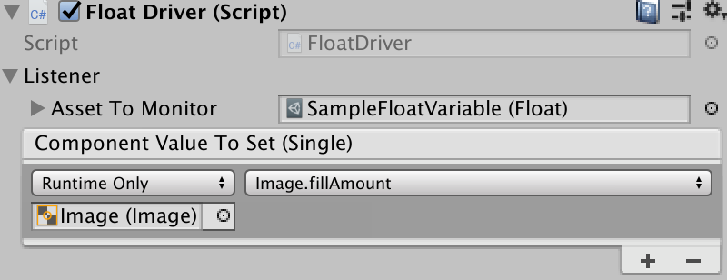

# Custom Assets
[TOC]
> Read the code in the Examples Folder and run the Example scene

## Executive Summary
Custom assets are C# classes that are Unity3D aware so that it is a project asset. They hold data set in the Unity Inspector, changed in-game if allowed and written to persistent storage. It also has an event system to alert components on change. The package includes listener MonoBehaviours, both generic and specific. There are granular custom assets around triggers, booleans, integers, floats and strings for decoupling data from game specific code. Sets provide a compelling alternative to enumerations while a dictionary allows access by key. For additional functionality, build your own using the supplied `AudioClips` as a sample.

As well as a single piece of Data, custom assets also have the concept of members. So, a health storage asset could have many results accessible by the name of the member.

The custom assets package includes an in-memory pooling system for performance, helpers for working with assets and a basic play mode test framework.

## Introduction
Unity provides a base class called [ScriptableObject](https://docs.unity3d.com/ScriptReference/ScriptableObject.html). Derive from it to create objects or assets that don't need to be attached to game objects.

In short, a `ScriptableObject` is a class that contains serialisable data and functionality. Each instance of a class that derives from `ScriptableObject` has representation on disk as an asset. Each asset is a source for data and actions not coupled to a scene. The decoupling makes for functionality that is easy to test. It also provides modules to be shared across and between projects.

Custom assets are scriptable objects with benefits.
* They have a description associated with them that make editor usage easier. The creator can provide more information than just a name on the why and wherefore of an asset.
* All custom assets can have listeners registered against them that get informed of changes in value. In may, new cases components can react to or create changes without additional code.
* Storage can be of anything serialisable - from primitives like float to complex objects, or even MonoBehaviours.
* Custom assets can be saved on program exit and reloaded at startup, providing a clean and straightforward persistence mechanism. Assets marked as critical will persist immediately, and every time they change.
* Basic types offered include Float, Integer, Boolean, Trigger, String and Set.
* Every custom asset has a dictionary of members to save more than one copy of data - accessed by name.

### Custom Assets - the new Singleton
Static variables are not evil, just inflexible. Singleton MonoBehaviour instances are not corrupt either. However, both encourage tight coupling between interested parties.

And now for a bit of mild blasphemy. Assets created from scriptable objects, and hence custom assets are Unity supported *singletons*. Create `[SerializeField]` fields and drag an asset of the correct type onto them in the editor. All will reference the same in-memory instance.

Using custom assets over traditional singletons provide some benefits:

* Code is less coupled - or is that more decoupled?
* Custom assets can be tested in isolation.
* Alternative custom assets can be injected into objects that are expecting them. An inventory may depend on location or whether the player is in training mode.
* It is less error prone to pass custom assets between scenes and projects.
* Functionality can be more generalised for direct reuse from within the editor without writing as much scaffolding code. A `Float` custom asset, for example, can have listeners that hook into display objects. It can also be updated by sliders and scroll-bars without additional code by adding it to the *On Value Changed* field.
* A custom asset as a singleton to hold game data has one massive failing. There is one copy only. If you want to store player health for an unknown number of players, how do we save it? For this, custom assets have the concept of members. Each named entry holds a reference to the custom asset storage that can be accessed by member name.

### Custom Assets as Game Managers
Managers are a favourite Unity pattern. As well as a system-wide master manager, many games have them for player, enemies, sound and more. They have some standard features:

* They are accessed by a static `Instance` variable.
* They are a MonoBehaviour that sets `Instance` in `Awake()`.
* They will call `DontDestroyOnLoad(gameObject)` if they are to be common across scenes.
* There is often one manager to rule them all.

It is not uncommon to see code like:

```C#
health = GameManager.Instance.PlayerManager.MaxHealth;
```

Try testing that component in isolation.

By contrast, a custom asset approach would be more like:

```C#
[SerializeField] PlayerManager;
...
health = PlayerManager.MaxHealth;
```

To work with this version create a test scene and put in an individual PlayerManager custom asset. It might have different data, or it might include mock methods.

### Custom Assets as Configuration
The most common use for scriptable objects is to ignore the scriptable part and use them as configuration containers. A Custom Asset is a file within the project. This file contains a reference to the script and serialised copies of all the data as added in the Unity editor.

You can safeguard the serialisable data by making it a private `[SerializeField]` and using accessors to allow reading. Alternatively, you can use them as seed data and change them during program execution.

```C#
class MyData : CustomAsset {
[SerializeField] private int maxHealth;
[SerializeField] private float timeOfDay;

// maxHealth cannot be changed outside this class
public int MaxHealth { get { return maxHealth; } };
// timeOfDay can be updated
public float TimeOfDay { get { return timeOfDay; } set { timeOfDay = value; } };
```
Later I will introduce better and more granular ways to handle data.

### Read-only Custom Assets
The custom asset inspector allows a designer to mark the asset read-only For serialisable classes as values, protection of internal data is still code bases. Make the fields private and serialisable so that the editor can change them. Then use accessors without `set` to only allow for reading. If you can't trust the code accessing data in a complex object graph, either clone the custom asset or lock down access at all levels.

```C#
var clone = Object.Instantiate(myCustomAsset).Value;
```

Cloning is much more expensive at runtime than baking in protection during the compile phase.

### Custom Assets and Persistence
Custom Assets adds optional persistence to scriptable objects. Persistent assets must be read/write and have the `persistent` field set in the Unity Editor.

Each persistent object is serialised to JSON and written as a `PlayerPref` entity. For this reason, the total storage is about one megabyte. For more massive storage needs, use a database.

The key is made up of the name of the asset and the class name, making it unique to the application.

## Accessing Custom Assets

A custom asset is like any other Unity asset. Create a field for it in a MonoBehaviour or other CustomAsset class and drop in the reference.

```C#
public sealed class CustomAssetsExample: MonoBehaviour {
  [SerializeField] private Float             maxFloat;
  [SerializeField] private Float             currentFloat;
  // ...
}
```


Custom assets aid decoupling. Many components can operate without directly knowing each other.

Access custom asset values by either casting or using the `Value` getter. ToString() will aways call ToString() on the Value field.
```C#
Debug.LogFormat("{0} == {1}",maxFloat.Value, ((float) maxFloat);
Debug.LogFormat("{0} == {1}",maxFloat.Value.ToString(), maxFloat.ToString());
```

## Creating Custom Assets
Custom Assets are ScriptableObjects serialised and written to disk as an asset in the project.

```YAML
%YAML 1.1
%TAG !u! tag:unity3d.com,2011:
--- !u!114 &11400000
MonoBehaviour:
  m_ObjectHideFlags: 32
  m_PrefabParentObject: {fileID: 0}
  m_PrefabInternal: {fileID: 0}
  m_GameObject: {fileID: 0}
  m_Enabled: 1
  m_EditorHideFlags: 0
  m_Script: {fileID: 11500000, guid: 22f206729bb7e417e9b12649707e941e, type: 3}
  m_Name: SampleFloatVariable
  m_EditorClassIdentifier: 
  Description: 
  value: 0
  readWrite: 1
  persistent: 0
  critical: 0
```
Each custom asset type has an entry on the ***Create / CustomAssets / asset name***. Use it, select the resulting file and fill in the fields. If you want to load it from disk using `Resources.Load(pathFromResources)` you will need to place it in a ***Resources*** folder.

### OfType&lt;T>
`CustomAsset.OfType<T>` is the base type for all custom assets except `Trigger`. Functionality includes being able to register events on change, persistence and some read-only protection.
```C#
[CreateAssetMenu(menuName = "Examples/LargerAssetSample")]
public class LargerAssetSample : CustomAsset.OfType<LargerAssetContents> { }

[Serializable]
  public class LargerAssetContents {
    public int    Order;
    public float  Limit;
    public string Name;
  }
```

All CustomAsset instances have a description field. Since you can use generic assets, it is useful to give others comments on what specific assets represent.

### Primitive Custom Assets
```C#
  [SerializeField] private Float             currentFloat;
  [SerializeField] private Integer           integer;
  [SerializeField] private String            str;
  [SerializeField] private Boolean           boolean;
```
Each if these custom assets can in a project with or without supporting code. It is possible, for example, to have a `Float` value set in the ***On Value Changed*** field of a Slider or Scrollbar, then displayed using listener like `CustomAsset.UIImageFillListener()` to set the fill amount on a health bar,

### Trigger
A trigger is unusual in that it does not have any data apart from CustomAsset requirements. Triggers do not have persistence, so a subclass containing data cannot be saved.

### Members
A custom asset with any content data also can store and retrieve separate copies by name. For persistent custom assets, the member names and values saved to storage along with the main value.

```C#
[SerializeField] CustomAsset.Integer myInt;
// ...
myInt.Value = 22;
myInt["One"] = 1;
myInt["Two"] = 2;

string[] names = myInt.MemberNames;
Assert.AreEqual(names.Length, 2);

Assert.AreEqual(myInt["One"], 1);
Assert.AreEqual(myInt.ToStringForMember("One"), "1");
Assert.True(myInt.Contains("One"));

myInt.Remove("One");
Assert.False(myInt.Contains("One"));

Assert.True(myInt.Contains("Two"));
myInt.Clear();
Assert.False(myInt.Contains("Two"));
```
`ToStringForMember` requires special mention as it can be use in Inspector event receivers to set values directly.

### Custom Asset Sets
`Set`, like `OfType` is a generic class. To instantiate it requires the type of the set entries.

```C#
[CreateAssetMenu(menuName = "Examples/SetPicker", fileName = "SetPickerSample")]
public sealed class SetPickerSample : Set<AudioClip> {
  public void Play() { AudioSource.PlayClipAtPoint(clip: Pick(), position: Vector3.zero); }
}
```
This example can be used to play one of a selection of sounds. This is a great way to make a game sound less tedious.

#### Pick()
All classes inheriting from `Set` have a `Pick()` method with two controlling field entries:
* ***cycle***: True to return entries sequentially, false to get a random selection.
* ***exhaustiveBelow***: If the number of entries in the set is below this value, then while `Pick()` will return a random entry, no entry will be retrieved twice before all the others have had a turn. From a list of three, nothing appears random.

These options are available in the editor when you create a custom asset from a `Set`.

#### Add(entry)
While in most cases the `Set` will be filled by the Unity Editor to save as an Asset, there are occasions where adding additional elements will be needed.
#### Remove(entry)
On occasions, a `Set` entry will expire, and it will be necessary to remove them.
#### Contains(entry)
See if a `Set` contains a specific entry.
#### Count
Retrieve the number of entries in a set.
#### ForEach
Call an action for every entry in a set. If the action returns false, all is complete.
```C#
mySet.ForEach((s) => {return s!="Exit";});
```
#### StringSet
Strings as a set have many usages. `Quotes` is an implementation of `StringSet`.

### AudioClips
Playing one from a selection of audio clips have been a well-used proof of concept for `ScriptableObject`. Because custom assets, sets and some other toys from this package make the implementation even simpler, I am displaying the source here.

```C#
  [CreateAssetMenu(menuName = "Custom Assets/Sound Clips", fileName = "Clips")]
  public sealed class AudioClips : Set<AudioClip> {
    [SerializeField, Header("Audio")]     private Range volume   = new Range(1, 1);
    [SerializeField, RangeBounds(0, 2)]   private Range pitch    = new Range(1, 2);
    [SerializeField, RangeBounds(0, 999)] private Range distance = new Range(1, 999);

    public void Play(AudioSource source) {
      source.clip        = Pick();
      source.pitch       = pitch.Pick();
      source.volume      = volume.Pick();
      source.minDistance = distance.Min;
      source.maxDistance = distance.Max;
      source.Play();
    }
  }
```
`Range` class and `RangeBound` attribute are available in the custom assets package. `AudioClips` will work without them, but sliders are easier to use.

The actor, `Play`, requires an `AudioSource`. An audio source must be attached to the game object that is to make a sound so that it comes from the correct source. It cannot be part of a custom asset which is not a component.

Fortunately, the Unity framework has a solution for that problem. It is called `UnityEvent`.

```C#
  [SerializeField] private AudioClips audioClips;
  [SerializeField] private UnityEvent audioClipsEvent;
```
will display in the inspector as follows.


The reference to `AudioClips` is optional. It is only there so that we can change the fields in the editor without going to the asset.

If you are calling `Play` from code, then you can supply an `AudioSource` or a game object that has an audio source component.

```C#
  [SerializeField] private AudioClips audioClips;
  void Play() { audioClips.Play(gameObject); }
  void Play1() { audioClips.Play(GetComponent<AudioSource>(); }
```

Using `AudioClips` wherever you have sound effects will make your game sound a lot more lively. You could also consider making similar assets for visual effects or animations.

## Editing Custom Assets
Serialised fields can be edited in the Unity Inspector just as you would a MonoBehaviour attached to a game object. Unlike a scriptable object, custom assets unload when play mode completes. In this way, they behave more like MonoBehaviours. There is a reason for this madness. In the Unity editor, scriptable objects remain loaded and only reload if the backing code or asset changes on disk. If we don't reset on leaving play mode, changed data from one run lives to the next.

## Custom Assets as Resources
If you can accept the tighter coupling, you can load custom assets my name. It is an alternative to dropping them into referring fields in the Unity inspector. The custom asset must reside in a directory under a ***Resources*** path - anywhere in the project.

```C#
// expects /anywhere-in-assets/Resources/Audio/cow-sounds.asset
var moos = Resources.Load<AudioClips>("Audio/cow-sounds");
```

## Custom Assets as Event Sources
The first significant departure from ScriptableObject that CustomAsset provides is the ability to act as an event source.

Primitive custom assets (trigger, boolean, integer, float and string) are extremely easy to use. Drag a reference using the Unity editor into any MonoBehaviour or CustomEvent that needs to access or update them.

Listeners (described below) also need a reference. They will then register for changing events. The event fires when and only when the custom asset changes.

```C#
  [SerializeField] private Float             currentFloat;
  //Called by button press
  public void UpdateCustomFloat() { currentFloat.Value = currentFloat + 1; }
//...
public sealed class DirectEventListenerSample : CustomAsset.Listener {
  [SerializeField] private Text textComponent;

  public override void OnTriggered() {
    textComponent.text = "Direct Event heard at " + DateTime.Now;
  }
}
```


## Custom Assets as Event Listeners
Life begins now. Without writing any code, you can use the prepackaged custom assets and listeners to connect components without them knowing about each other.

Don't believe me? Create a game object inside a canvas and add a slider component.

***Step 1***: Create a Float custom asset from the Unity editor main or context menu.


***Step 2***: Select the custom asset and add any initial data. Make sure it is set read/write.


***Step 3***: Create a new GameObject in the Unity Hierarchy window. Make sure it is inside a Canvas GameObject.


***Step 4***: Go to the inspector for the game object *Slider* and add a slider component.


***Step 5***: Add an *On Value Change* field and drag the Float custom asset into the associated field. Use the function drop-down to select ***Float: Value***.


***Step 6***: Lock the inspector on the Float custom asset and run the scene. Drag the slider and watch the value change in the inspector.


For extra points, we can create a codeless listener.

***Step 7***: Create a UI Button GameObject in a Canvas and change the image type to *Filled*. Note that moving the *Fill Amount* slider causes the button to change background proportionately.


***Step 8***: Press the *Add Component* Button then search for and add the *UI Image Fill Listener* component. Set the custom asset to the one created above.



***Step 9***: Run the application and move the slider created above. The button will fill and empty accordingly


All concrete listeners must implement `void OnChange(string memberName)`.

A listener has a `ForMember` entry visible in the inspector. If this entry is not empty, then only events sent from matching members will pass through. It allows an image fill listener for a health bar to react with a related member.

### Generic Component Listeners
The other end of the Custom Asset event pipeline can be a listener MonoBehaviour. The generic implementations below are designed to support functionality for the attached GameObject. Concrete listeners must implement `Change(value)` where *value* is the primitive encapsulated by a base custom asset.

`Change` is member aware. If the event triggers with a member name, it provides the related value for processing.

In the example below, we see a component for changing the text in a UI Text component. It finds one element on the current GameObject of the generic type. `Change()` can then use it to manipulate said item given the new value.

```C#
  public sealed class UITextListener : StringListener<Text> {
    protected override void Change(string value) { Component.text = value; }
  }
```


All component listeners will have access to the `Component` and the `CustomAsset` that will trigger the action.

```C#
    protected override void Change(float value) { Component.alpha = value; }
      Change((memberName == null) ? (TD) CustomAsset : CustomAsset[memberName]);
```

#### BooleanListener
```C#
  public sealed class AnimatorBooleanListener: BooleanListener<Animator> {
    [SerializeField] private string   parameterName;
    [SerializeField] private Animator animator;

    protected override void Change(bool value) { animator.SetBool(parameterName, value); }
  }
```
#### StringListener
Not that unlike other generic listeners, a string listener will work with any custom asset that implements `ToString()`

#### FloatListener
```C#
  public sealed class UIImageFillListener : FloatListener<Image> {
    protected override void Change(float value) { Component.fillAmount = value; }
  }
```
#### IntegerListener
  public sealed class AnimatorIntegerListener : IntegerListener<Animator> {
    [SerializeField] private string   parameterName;
    [SerializeField] private Animator animator;

    protected override void Change(int value) { animator.SetInteger(parameterName, value); }
  }
### Concrete Component Listeners
The components listed here are part of a growing list of listeners that can used to minimise coupling and reduce project specific code.

#### UI Listeners
##### UICanvasGroupAlphaListener
By adding a canvas group to any GameObject inside a canvas, we can change the transparency (alpha) for all GameObjects inside the hierarchy.

This listener, when added to the same GameObject, will monitor a Float custom asset and change the canvas group transparency accordingly. I find it useful to fade panels in and out.

##### UIImageFillListener
Images in fill mode make good health and stamina bars. Rather than code them separately for each requirement in each project, create a Float custom asset. Use this listener to change the fill amount on the upper image. You can even consider making the Float persistent so that it does not change if the game restarts.

##### UITextListener
Because it is a `StringListener`, `UITextListener` can accept any custom asset and display the `ToString()` conversion. Just drop it on to any game object that has a Text component, and you can change the value from anywhere.

#### Animation Listeners
Unity has an animation system that includes a state machine and associated animation timelines, packaged with the project as an Animator Controller and Animation assets.

Given a reference to an Animator the code can trigger state changes directly or by modifications to boolean, float or integer parameters.


### Unity Event Listeners
The Unity event system more tightly couples components than custom assets. Listeners must have a reference to the element containing it to be able to signal their interest. With custom assets, the event is owned by a third party that also happens to include the data that triggered it.

In the following example, we have a UnityEventListener MonoBehaviour that has a reference to a Trigger custom access. When the trigger fires it plays the audio source.


## Custom Asset Persistence
If a custom asset is marked persistent or critical in the Inspector, then it will write itself out to the PlayerPref database using a key combining the name and class.

For *critical* this happens as soon as a value changes. Do not set this unless it is necessary. Non-critical persistence occurs when the asset's `OnDisable` method is called - typically when the operating system has decided to throw the game out of memory.

For primitive assets, any updates happen without further coding.

```C#
  Float age;
  age.Value = 32.2f;
```

For custom assets containing a more complicated class or struct, the creator is responsible for marking changes either directly with `Changed()` or as part of the update. For the latter, creating accessors in the custom asset provided for clearer calling code that using Value directly - while calling `Set` on the update will tell all listeners.

```C#
[CreateAssetMenu(menuName = "Examples/LargerAssetSample")]
public class LargerAssetSample : CustomAsset.OfType<CustomAssetsExample.LargerAssetContents> {
  public int AnInteger { get { return Value.I; } set { Set(() => Value.I = value); } }

  public float AFloat { get { return Value.F; } set { Set(() => Value.F = value); } }

  public string AString { get { return Value.S; } set { Set(() => Value.S = value); } }
}
```

## Asset Support
### Components
`Components` is a static helper class with functions to create and find Components.

#### Components.Find&lt;T>(name)
Search the current scene for components of type `T`, then return the one with the name supplied. For a call with no name, we use the name of T.

If there are no matching objects in the scene, `Find` will try to load a resource of the supplied type and name. The name can be any path inside a ***Resources*** directory.

####Components.Find&lt;T>(inGameObject)
Find a component by type within a specified GameObject. If not found, do a global Find on the type.

#### Components.Create&lt;T>(gameObject, name)
Will create a component of type T inside the provided game object.  The instance of T is given the name supplied or the type name if the former is null.

#### Components.Create&lt;T>(name)
The overload that does not supply a gameObject will create a new one and name the same as the component. The new gameObject is attached to the root of the current hierarchy.

### Asset Pooling
Unity3D games can run on lightweight platforms such as phones, tablets and consoles. Virtual or augmented reality games are immersive, and the least stutter in frame-rate is evident and annoying. Two of the most prominent culprits during gameplay are instantiating many complex objects and garbage collection.

`Instantiate()` and `Destroy()` aren't evil, but using them on game objects that are regularly needed is an overhead that is better overcome. The solution is to use a pool of these objects. It minimises expensive instantiation, and the garbage collector does not have to reclaim the memory for every usage.

A GameObject becomes a pool of it has the `Pool` script attached. Any child object becomes candidates for pooling. Alternatively, you can drag the ***Askowl/Assets/Prefabs/Pools*** prefab into the hierarchy. You can have as many pools as you wish and they may reside in any scene. The names have to be unique.


In this example, three GameObjects are pooling aware. ***Scene GameObject*** has been created within the scene, while the other two copies of the same prefab with differing values in editor-available fields. They represent two different characters or effects that differ only in detail.

To retrieve a clone from the pool, use `Acquire()`. A new GameObject is cloned from the master if the pool is empty.

To release an object back to the pool, disable it.

```C#
myClone.gameObject.SetActive(false);
```
Never call `Destroy()` unless you don't want to reused the GameObject. It cannot be returned to the pool after `Destroy`.

#### Acquire GameObject by Name
Calling `Acquire` with the name of the GameObject will retrieve a clone from the pool, instantiating a new one if necessary. `Pool.Acquire("Scene GameObject")` does the trick, or returns null if the Pool did not contain an original by that name.

Seeding some of the GameObject information using optional parameters is possible.

#### Transform parent
An effect will have the target as the parent, while a character may have a spawn point or a team leader. Position and rotation below are relative to that of the parent.

#### Vector3  position
The location where the clone will spawn relative to the parent. It defaults to (0, 0, 0).

#### Quaternion rotation
The facing direction, relative to the parent.

#### bool enable
Defaults to true so that the clone is enabled when it is taken from the pool or created.

#### bool poolOnDisable
PoolOnDisable also defaults to true. Using `SetActive(false)` to disable a component will cause it to return to the pool. For situations where you want to enable and disable and as part of game processing, set `poolOnDisable` to false. Use `Pool.Return(clone)` to release the GameObject to the pool for reuse.

```C#
    for (int i = 0; i < 21; i++) {
      prefab1[i] =
        Pool.Acquire<PoolPrefabScriptSample>("PoolSamplePrefab",
                                             parent: FindObjectOfType<Canvas>().transform,
                                             position: new Vector3(x: i * 60, y: i * 60));
    }
```

#### Acquire GameObject by Type
The generic form of `Acquire` is a shortcut to get a component.
```C#
PoolPrefabScriptSample script = Pool.Asquire<PoolPrefabScriptSample>();
// is the same as
script = Pool.Asquire<PoolPrefabScriptSample>("PoolPrefabScriptSample");
// is the same as
GameObject clone = Acquire(typeof(T).Name);
script = (clone == null) ? null : clone.GetComponent<T>();
```
The same optional parameters are available as the non-generic game object - with the addition of name so that you can return a prefab with a different name to the MonoBehaviour inside.

#### PoolFor
Only in testing is it necessary to retrieve an item from a pool. 
Provide the string name of the master GameObject used to create the pool. The instance returns are of `PoolQueue` and provide two public interfaces.

1. public GameObject Master;
1. public GameObject Fetch();

Since `PoolQueue` is a C# `Queue` class, it inherits all those access and processing methods and fields.

### Quotes
`Quotes` is a `StringSet` Custom Asset that if given a list of lines and a `TextAsset` will return a line using the `Pick` interface. A quote is formatted as a ***body of the quote (attribution)*** where the attribution is optional. The attribution is surrounded in brackets and must be at the end of the line. RTF is acceptable in the quote.

I would recommend setting ***Exhaustive Below*** to a figure like 50 or 100. Otherwise shorter lists will appear to repeat entries too often.

#### RTF
RTF is a static function to convert a string quote into RTF format so that the attribution can be in grey. The text between brackets at the end of the line makes up the attribution.

```C#
Debug.Log(Quotes.RTF("Life wasn't meant to be easy (George Bernard Shaw)"));
```
produces
***"***Life wasn't meant to be easy***"***     *George Bernard Shaw*

### Selector
It is useful to select one item from a list as needed from a random list of images and sounds to an ordered list of training steps.

```C#
Selector<int> selector = new Selector<int> (new int[] { 0, 1, 2, 3, 4 });

for (int idx = 0; idx < 100; idx++) {
  int at = selector.Pick();
  Use(at);
}
```
#### Selector Initialiser
The magic is in having different pickers for different requirements. The constructor allows for three types. Add more by overriding `Pick()`.

```C#
Selector(T[] choices = null, bool isRandom = true, int exhaustiveBelow = 0);
```

* ***Sequential***: `isRandom` is false or;
* ***Random***: `exhaustiveBelow` is less than the number of choices.
* ***Exhaustive Random***: `exhaustiveBelow` is greater than the number of choices.

In ***Exhaustive Random*** mode items are returned in a random order, but no entry shows up a second time until all are exhausted.

#### Selector Choices
If the list of items to choose from changes, update the selector with `Choices`. The same picker will be reset and used.

```C#
Selector<int> selector = new Selector<int> (new int[] { 0, 1, 2, 3, 4 });
selector.Choices = new int[] { 5, 6, 7, 8 };
```

#### Selector CycleIndex
`CycleIndex` return the index in the `Choices` array of the last item returned. If we were using `Selector` to return the next training item, then we may well need the index to report progress.

### Pick&lt;T>
`Random` is the default picker. In small lists is may appear to be favouring one or another asset.

There is are NUnit Editor tests in ***Examples/Scripts*** that demonstrate all the pickers.

### Preview Custom Editor
Unity custom editors provide additional functionality for the Inspector panel. `PreviewEditor&lt;T>` is a generic that adds a ***Preview*** button to the bottom of the Component.

`AudioClipsEditor` is a custom class that plays a sound when pressing ***Preview***.

```C#
  [CustomEditor(typeof(AudioClips))]
  public class AudioClipsEditor : PreviewEditor<AudioSource> {
    protected override void Preview() { ((AudioClips) target).Play(Source); }
  }
```

### Range
`Range` is a `Pick` class with serialised low and high values. Calling `Pick()` will return a random value within but inclusive of the range.

By default, the range can be between 0 and 1. Using `RangeBounds` below allows for different scales.

```C#
    [SerializeField]     private Range volume   = new Range(1.0f, 1.0f);
      source.volume      = volume.Pick();
```
In this example, the potential range is between 0.0 and 1.0 inclusive, but the sliders are both to the right at 1.0.
The initialiser can be empty and the values set by public `Min` and `Max` variables.

A range drawer provides better visual editing of ranges in the Inspector.


Range values can be set with the sliders or by typing values on the boxes to the left and right.

### RangeBounds Attribute
For more meaningful ranges we add an attribute called `RangeBounds`.

```C#
    [SerializeField, RangeBounds(0, 2)]   private Range pitch    = new Range(1, 2);
    [SerializeField, RangeBounds(0, 999)] private Range distance = new Range(1, 999);
```
The width of the range limit how many digits past the decimal point display.

### Objects Helpers
I am lazy. I hate typing the same scaffolding code repeatedly. These are functions more often used in testing than production code.

### Find&lt;T>
Use `Find` to search the project for Unity Objects of a defined type with a known name. The object does not have to be enabled.

```C#
GameObject mainCamera = Objects.Find<GameObject>("Main Camera");
```

Often the object is unique and named after it's underlying class.

```C#
setPickerSample = Objects.Find<SetPickerSample>();
```

`Find` is resource hungry. Only use it in rarely called methods like `Awake`, `Start` or `OnEnable`. It is never necessary for production code but is an excellent helper with play mode tests. 

### Component&lt;T>
`Component` is another tool for play mode testing. Without being part of the game, test code can retrieve a GameObject by unique name/path the then return a reference to a Component of that game object. Because we do not have a game object starting point, the name must be unique. Either a unique name within the scene or an absolute path.

```C#
    results      = Component<Text>("Canvas/Results Panel/Text");
    results.text = "I found you";
```


## PlayMode Test Runner Support
Askowl Custom Assets are tested using the Unity editor PlayMode test-runner. Because this is the core Askowl unity package, it includes the rudimentary support for testing. See the Askowl TestAutomator package for more exhaustive support.

### PlayModeController
PlayModeController is a base class for protected methods used to control actions in the game. Most of the methods are to be run in Coroutines so that control code can wait for them to complete. It is designed to be used by *PlayModeTests* and *RemoteControl* classes.

#### Scene
The protected reference to the loaded `Scene` object.

#### LoadScene
Load a scene by name from the scenes list in the build. Most often this function is used to load the starting scene for the game.

Sometimes tests have a scene to highlight actions that are difficult to reproduce in game-play. They will have to be added to the build, but will not include much overhead to the release game.

```C#
  [UnityTest] public IEnumerator AccessCustomAssets() {
    yield return LoadScene("Askowl-CustomAssets-Examples");
    //...
  }
```

#### PushButton
At the very least a player will have to push a button to start the game. You can select the button by the name and path in the hierarchy or a `Button` reference.

```C#
yield return PushButton("Canvas/Show Quote");
// same as
yield return PushButton(Objects.Component<Button>("Show Quote"));
```
The coroutine will return after one tick - giving time for the button watchers to react.

#### Log
Typing `Debug.LogFormat()` gets tiring. For classes that inherit, you can use `Log()` instead.

```C#
Log("Entering Scene {1}", Scene.name);
```

### PlayModeTests
`PlayModeTests` inherits from `PlayModeController` and in turn is to the the ancestor of concrete tests within Unity.

Firstly it overrides functions to add assertions.

* LoadScene(string name) from PlayModeController
* PushButton(string path) from PlayModeController
* Component<T>(string name) from Objects.Component<T>(name)
* FindObject<T>(string name) from Objects.Find<T>(name)
* FindObject<T>() from Objects.Find<T>()

#### PlayModeTests.Component
Use this static method rather than `Objects.Component` when testing to retrieve a typed component from a named `GameObject` in the current scene. It marks a failure if the component cannot be retrieved.

```C#
Text results = Component&lt;Text>("Canvas/Results Panel/Text");
```

#### PlayModeTests.FindObject
Use this static method rather than `Objects.Find` when testing to retrieve a named `GameObject` in the current scene. It marks a failure if the component cannot be retrieved.

```C#
Float currentFloat = FindObject&lt;Float>("SampleFloatVariable");
AudioClips  picker = FindObject<AudioClips>();
```
The latter example will find a GameObject called *AudioClips*.

#### PlayModeTests.PushButton
Given the text name of a game component in the scene, treat it as a button and perform the same action as when a player pushed it on the game screen.

#### CheckPattern
Sometimes we need to look at some UI text and see if it is as expected. We use regular expressions for that.
```C#
    CheckPattern(@"^Direct Event heard at \d\d/\d\d/\d\d\d\d \d\d:\d\d:\d\d", results.text);
```
### A Sample Play Mode Test
Because we sent the slider with a quote, we need to test a range to make sure all is as it should be.
```C#
[UnityTest]
  public IEnumerator TestIntegerAsset() {
    yield return Setup();

    Slider slider = Component<Slider>("Canvas/Integer Asset/Slider");
    slider.value = 0.77f;
    yield return null;

    int buttonValue = int.Parse(ResultsButtonText);
    Assert.GreaterOrEqual(buttonValue, 76);
    Assert.LessOrEqual(buttonValue, 78);
  }
```
